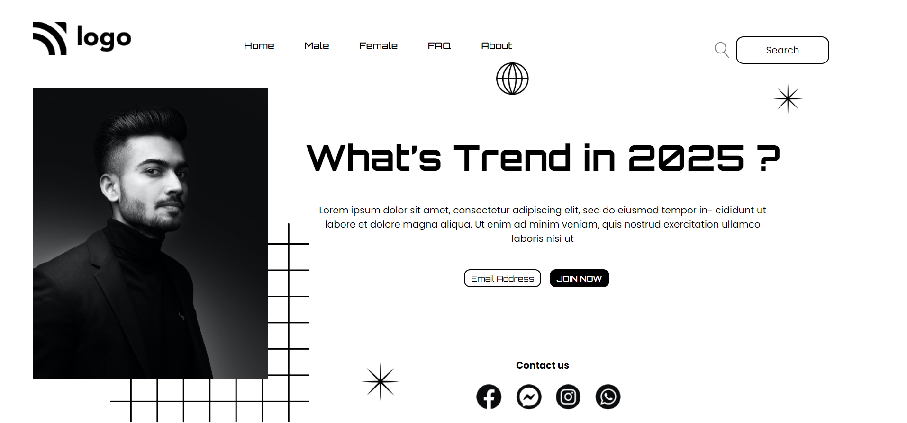

# HTML Project 1

> This is my first project of HTML and CSS It is a very basic static page but I learned alot.
 #
## Project Web page

#
As you can see the net of square that is below to the person image by that I came to know about the z-index
And I learn alot about position in css.

[Visit this website](https://abhi-project-1.netlify.app/)

#

To see my work visit my [Portfolio]("my-portfolio-website")

